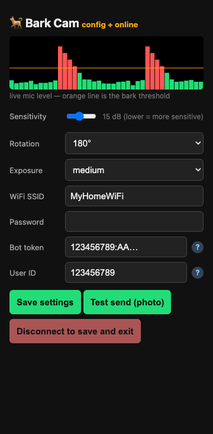

# Bark Cam 🐕

Dog bark monitor on the **Seeed XIAO ESP32S3 Sense**. When it hears your dog
bark, it takes a photo and sends it to you on Telegram.

**v0.2:** hear bark → 1 photo → Telegram, max one photo per 2 minutes no
matter how long the dog barks. Plus a phone-based config UI, OTA updates, and
a watchdog that reboots on a stalled loop.

## What it looks like

The config UI, served from the board's access point — what your phone sees:



## How bark detection works (no AI model)

The cheap $20 "bark sensors" don't do sound recognition either — they detect
*a loud sudden sound* above a threshold. Bark Cam does the same trick with
better signal processing on the board's PDM mic:

1. One-pole high-pass (~250 Hz) removes rumble and AC hum
2. Per-frame RMS → dB envelope (16 ms frames)
3. Adaptive noise floor tracks the quiet ambient level
4. Burst shape check: a bark is a fast attack lasting ~50–380 ms
5. Confirmation: ≥2 such bursts within 4 s (dogs bark in sequences; a door
   slam is one event)

For a single dog in your own yard this works well and costs almost no CPU.
The detector lives in `include/bark_detector.h` behind a small interface, so
it can be swapped without touching the rest.

## Hardware

- XIAO ESP32S3 **Sense** (base board + Sense expansion: OV2640 camera, PDM
  mic, microSD). A plain XIAO ESP32S3 has no camera/mic and won't work.
- Power: USB-C (data cable). v0.2 runs always-on (~100–110 mA with WiFi up,
  ~350 mA peak during a capture) — continuous listening is the point; deep
  sleep can't listen. Battery sizing is a v2 topic.

## Setup (one-time)

1. Flash and power on the board. For 10 minutes it broadcasts an open
   `barkcam-config` access point — connect your phone to it and open
   http://192.168.4.1.
2. Set your WiFi, bot token (from @BotFather), user ID, sensitivity, rotation
   and exposure. Hit **Save settings**. The AP closes itself when your phone
   disconnects (or tap "Disconnect to save and exit"). Everything persists in
   NVS across reboots.
3. Open t.me/\<yourbot\> in Telegram and press **Start** — a bot can't message
   you until you do.

You can reopen the config UI any time with serial command `a`.

## Build & flash

cd barkcam                                             # the cloned repo
cp include/credentials.h.example include/credentials.h   # any values — web UI overrides them
pio run -t upload --upload-port /dev/cu.usbmodemXXXX   # your board's port
```

Flashing works over USB with no button pressing (`--no-stub` is set in
platformio.ini). No `pio device monitor` — it crashes on the USB-JTAG port.
Read serial with pyserial instead:

```bash
python3 -c "import serial,time,sys; s=serial.Serial('/dev/cu.usbmodemXXXX',115200,timeout=0.5); [sys.stdout.buffer.write(s.read(4096)) or time.sleep(0.2) for _ in range(300)]; print()"
```

## Test it

Serial commands (type them in the serial console):

| key | action |
|---|---|
| `t` | force a test photo + Telegram send (bypasses detector & cooldown) |
| `s` | print status: noise floor, threshold, last frame level, cooldown |
| `c` | clear the cooldown so the next bark sends immediately |
| `o` | force an OTA check now (downloads + applies if the server has a newer version) |
| `1` / `2` | raise / lower detection threshold by 2 dB (live, no reflash) |
| `w` | scan WiFi networks, list top 12 by signal (find your SSID) |
| `i` | print current WiFi: SSID, IP, RSSI |
| `a` | reopen the config access point (web UI) now |

To test the detector without waiting for the dog: play a dog-barking sound
through speakers near the board and watch serial for `BARK EVENT`.
No hardware handy? `python3 tools/mock_ui.py` serves the config UI with fake
data at http://127.0.0.1:8653 — handy for UI tweaks and screenshots.

## Tuning (if it misbehaves)

All knobs are in `include/config.h`:

| knob | default | meaning |
|---|---|---|
| `THRESHOLD_MARGIN_DB` | 15 | dB above noise floor to count as a bark. Too many false triggers → raise. Misses barks → lower (or use `1`/`2` live). |
| `BARKS_TO_CONFIRM` | 2 | barks within the window to fire an event. Raise to 3 if door slams trigger it. |
| `BARK_WINDOW_MS` | 4000 | window for counting barks |
| `COOLDOWN_MS` | 120000 | hard cap: one photo per 2 minutes |
| `BURST_MIN/MAX_FRAMES` | 3 / 24 | ~50–380 ms bark duration window |
| `TZ_OFFSET_HOURS` | 0 | UTC offset for photo captions (e.g. -7 for Pacific) |

## OTA updates (no reflash needed)

The board polls `http://<OTA_HOST>:8652/version` every 10 minutes. To push
new firmware from the Mac:

```bash
cd barkcam
pio run                                            # build
cp .pio/build/seeed_xiao_esp32s3/firmware.bin ota/firmware.bin
echo 3 > ota/version                               # bump past the board's version
python3 ota/server.py &                            # serve (can stay running)
```

The board sees the newer version, downloads `firmware.bin`, reboots into it —
`ota: update applied` on serial. Bump `FIRMWARE_VERSION` in `include/config.h`
and `ota/version` together for each release. If the server isn't running, the
board silently skips the check — OTA is opt-in per session.

## Roadmap (v2)

- 3–4 photo grid per event (compose on a small Python bridge)
- Battery/deep-sleep strategy, SD card logging

## Gotchas

- Pin `espressif32@6.9.0` — Arduino core 3.x breaks the legacy I2S PDM API
- Flash with `--no-stub` @ 115200 (USB-JTAG desyncs on stub baud switch)
- USER LED is active-LOW; don't trust the BOOT button (GPIO0 strapping)
- `http.begin()` needs a *named* WiFiClient, never a temporary
